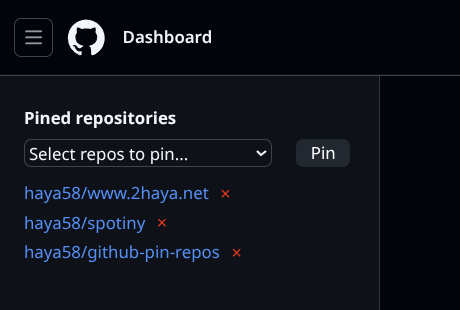
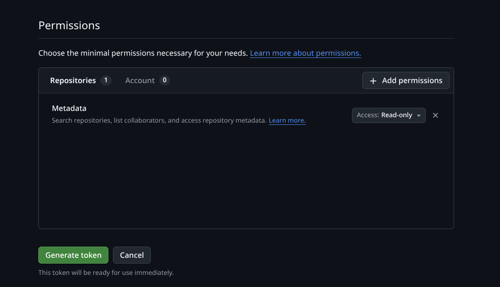
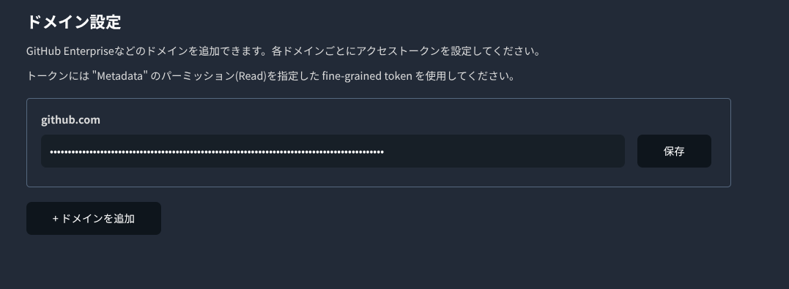
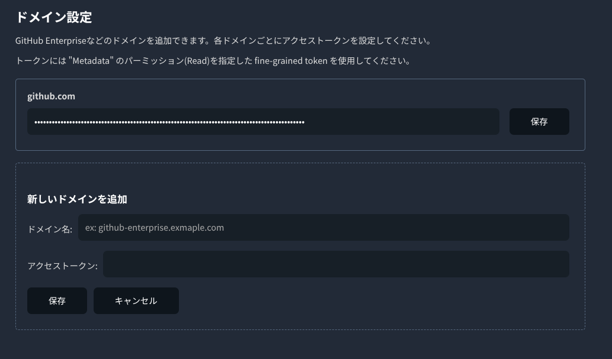

# github-pin-repos

github のトップページにリポジトリをピン留めできるようにする Chromium 拡張機能

## 機能
- github のトップページに好きなリポジトリをピン留め
- github.com と独自ドメインの Github Enterprise に対応

## インストール
- このリポジトリを git clone またはダウンロード
- `chrome://extensions/` > 「パッケージ化されていない拡張機能を読み込む」をクリック
- ダウンロードしたリポジトリを指定する

## 設定
### アクセストークンの取得
リポジトリ情報の取得のため、Github のアクセストークンが必要です。

**アクセストークンはすべてユーザのブラウザ内に保存され、外部へ送信されることはありません。また、入力されたトークンはリポジトリ情報の取得以外には使用されません。**

事前に https://github.com/settings/personal-access-tokens へアクセスし、Fine-grained personal access tokens を取得してください。
トークンの Permissions には、以下のように Metadata の Read 権限を指定してください。

### アクセストークンの設定
設定画面から「拡張機能のオプション」を開き、取得したアクセストークンを入力して保存します。

### 独自ドメインの設定
「新しいドメインを追加」をクリックし、独自ドメインの Github の設定を追加します。
ドメイン名と、各サイトで取得したアクセストークンを入力してください。

